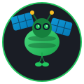
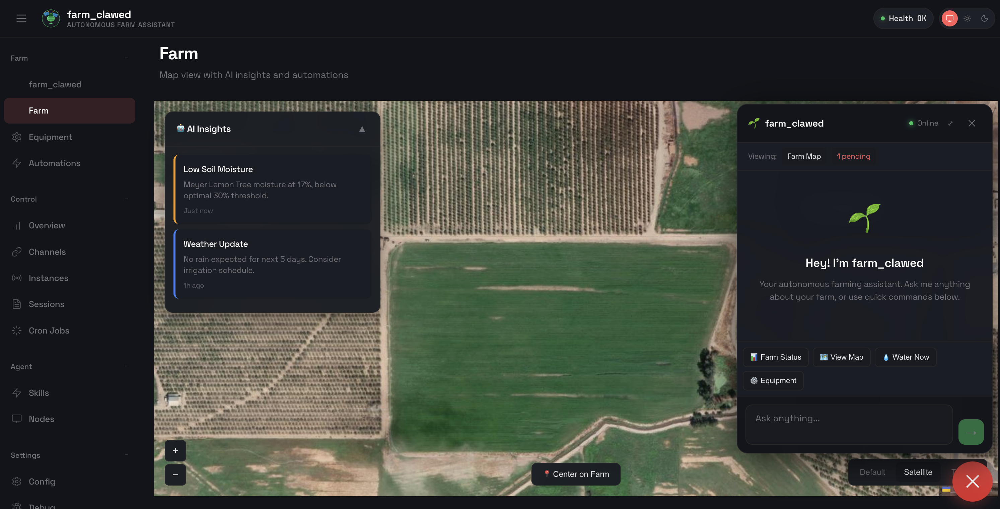
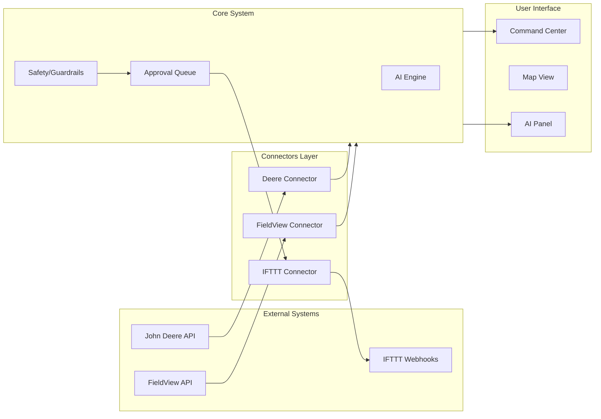

# farm_clawed — AI Farm Command Center

<p align="center">
  
</p>

<p align="center">
  <strong>Your autonomous farming command center with AI copilot</strong>
</p>

<p align="center">
  Connect John Deere or FieldView. Or start fresh. AI handles the rest.
</p>

<p align="center">
  <a href="https://github.com/rahulraonatarajan/farm_clawed/actions/workflows/ci.yml?branch=main"></a>
  <a href="https://github.com/rahulraonatarajan/farm_clawed/releases"></a>
  <a href="LICENSE"></a>
</p>

<p align="center">
  
  
  
</p>

---

## What is farm_clawed?

**farm_clawed** is an AI-powered command center for your farm. Think of it as mission control — you see your fields on a map, and an AI assistant helps you make decisions about water, soil, pests, and operations.

**For farmers:** Connect your existing John Deere or FieldView account, and farm_clawed imports your fields automatically. Or start fresh with a simple setup wizard.

**For engineers:** farm_clawed is a modular, TypeScript platform with OAuth2 connectors, a plugin architecture, and local LLM support. Contribute connectors, skills, or UI components.

---

## The Command Center

<p align="center">
  
</p>

The Command Center is your primary interface:

| Left Side (60%) | Right Side (40%) |
|-----------------|------------------|
| Interactive map with your fields | AI assistant that knows your farm |
| Satellite/terrain layer toggle | Recommendations based on weather and soil |
| Click any field to select it | Quick actions: /status, /water, /plan |
| Color-coded field health status | Pending approvals and alerts |

---

## Three Ways to Get Started

### 1. Connect John Deere

If you already use John Deere Operations Center:

```
1. Click "Connect John Deere" in setup
2. Sign in with your Deere account
3. Select your organization
4. farm_clawed imports your fields, equipment, and operations
```

Your field boundaries, crop types, and work plans sync automatically.

### 2. Connect Climate FieldView

If you already use Climate FieldView:

```
1. Click "Connect FieldView" in setup
2. Sign in with your Climate account
3. Select your farm
4. farm_clawed imports your fields and prescriptions
```

Your field boundaries, activities, and imagery data sync automatically.

### 3. Start Fresh

No existing farm management system? No problem:

```
1. Click "Start Fresh" in setup
2. Choose your farm type (garden, orchard, ranch, row crop)
3. Draw fields on the map or import CSV/GeoJSON
4. Configure AI preferences
```

Works immediately with manual data entry. Add sensors and automations later.

---

## Key Features

| Feature | What It Does |
|---------|--------------|
| **Split-View Command Center** | Map + AI assistant side by side |
| **FMIS Integration** | Import from John Deere or FieldView |
| **AI Recommendations** | Get suggestions based on weather, soil, and history |
| **Safety-First Automation** | All actions require approval by default |
| **IFTTT Webhooks** | Control any smart device through IFTTT |
| **Local LLM Support** | Run offline with Ollama for privacy |
| **Permaculture Ready** | Optional zones, sectors, and guild planning |

---

## Quick Start

### Install

```bash
# Node 22+ required
npm install -g farm_clawed@latest

# Run onboarding wizard
farm_clawed onboard
```

### Run Locally (No External Keys Required)

```bash
# Start the gateway
farm_clawed gateway --port 18789

# Open the Command Center
open http://localhost:18789
```

The demo runs in simulation mode — you can explore all features without connecting external services.

### With Local AI (Ollama)

```bash
# Install Ollama
brew install ollama

# Pull a model
ollama pull llama3.2

# farm_clawed auto-detects Ollama on localhost:11434
```

---

## Choose Your Settings

### Permaculture Depth

| Level | Name | Best For |
|-------|------|----------|
| 0 | Standard | Conventional farming, row crops |
| 1 | Regen-Friendly | Soil health focus, cover crops |
| 2 | Permaculture-Lite | Food forests, guilds, zones |
| 3 | Full Permaculture | Complete design with succession |

### Automation Level

| Level | Name | How It Works |
|-------|------|--------------|
| 0 | Observe | View data only, no automation |
| 1 | Assist | AI suggestions, you execute |
| 2 | Propose | AI proposes, you approve (default) |
| 3 | Auto-Guardrails | Automatic within safety limits |
| 4 | Full Ops | Full automation with safety stops |

---

## For Engineers

### Architecture

```
farm_clawed/
├── src/
│   ├── connectors/
│   │   ├── fmis/
│   │   │   ├── deere/          # John Deere OAuth2 connector
│   │   │   ├── fieldview/      # Climate FieldView connector
│   │   │   └── csv-import/     # CSV/GeoJSON import
│   │   └── ifttt-webhooks/     # Generic IFTTT actuator
│   ├── farm/
│   │   ├── safety/             # Guardrails and Jidoka
│   │   └── ai/                 # AI provider abstraction
│   └── security/
│       ├── secrets-redactor.ts # Log sanitization
│       └── env-validator.ts    # Runtime config validation
├── ui/src/ui/views/
│   ├── farm-command-center.ts  # Split-view interface
│   ├── farm-ai-panel.ts        # AI assistant component
│   ├── farm-onboarding.ts      # Multi-path setup wizard
│   └── farm-map.ts             # Interactive map with Leaflet
└── extensions/
    └── ifttt-smartlife/        # SmartLife scene integration
```

### Data Flow



### Adding a New FMIS Connector

1. Create a new directory under `src/connectors/fmis/`
2. Implement the OAuth2 flow using `oauth-base.ts`
3. Export organization/field listing methods
4. Add UI integration in `farm-onboarding.ts`

Example skeleton:

```typescript
// src/connectors/fmis/myplatform/index.ts
import { OAuth2Config, exchangeCodeForTokens } from "../oauth-base.js";

export class MyPlatformConnector {
  async listFarms(): Promise<Farm[]> { /* ... */ }
  async listFields(farmId: string): Promise<Field[]> { /* ... */ }
  async fullSync(farmId: string): Promise<SyncResult> { /* ... */ }
}
```

### Environment Variables

```bash
# FMIS Integrations (OAuth2 - get from developer portals)
DEERE_CLIENT_ID=your-deere-client-id
DEERE_CLIENT_SECRET=your-deere-client-secret
FIELDVIEW_CLIENT_ID=your-fieldview-client-id
FIELDVIEW_CLIENT_SECRET=your-fieldview-client-secret

# Actuation (IFTTT Webhooks)
IFTTT_WEBHOOK_KEY=your-ifttt-key

# AI Provider (optional - defaults to Ollama)
AI_PROVIDER=local  # or openai, anthropic
AI_API_KEY=sk-...
```

### No Secrets Policy

farm_clawed enforces a strict no-secrets policy:

- All credentials stored in `.env` (never in repo)
- GitHub Actions run `gitleaks` on every PR
- Logs automatically redact tokens and keys
- Runtime validation warns about missing config

---

## Integration Guides

### John Deere Setup

1. Register at [developer.deere.com](https://developer.deere.com)
2. Create an application with OAuth2
3. Enable the Field Operations APIs you need
4. Add your credentials to `.env`:

```bash
DEERE_CLIENT_ID=your-client-id
DEERE_CLIENT_SECRET=your-client-secret
DEERE_REDIRECT_URI=http://localhost:18789/oauth/deere/callback
```

See [docs/connectors/deere.md](docs/connectors/deere.md) for details.

### Climate FieldView Setup

1. Register at [developer.climate.com](https://developer.climate.com)
2. Create an application with OAuth2
3. Request the `fields:read` scope
4. Add your credentials to `.env`:

```bash
FIELDVIEW_CLIENT_ID=your-client-id
FIELDVIEW_CLIENT_SECRET=your-client-secret
FIELDVIEW_REDIRECT_URI=http://localhost:18789/oauth/fieldview/callback
```

See [docs/connectors/fieldview.md](docs/connectors/fieldview.md) for details.

### Other FMIS (CSV/GeoJSON)

Export your field data from any system and import it:

```bash
# Import field boundaries
farm_clawed farm import --geojson fields.geojson

# Import sensor readings
farm_clawed farm import --csv readings.csv --type sensors
```

See [docs/connectors/csv-import.md](docs/connectors/csv-import.md) for templates.

### IFTTT Webhooks

Connect any smart device through IFTTT:

1. Go to [ifttt.com/maker_webhooks](https://ifttt.com/maker_webhooks)
2. Get your webhook key from Documentation
3. Create applets for your devices (e.g., `farm_clawed_water_2min`)
4. Add to `.env`:

```bash
IFTTT_WEBHOOK_KEY=your-key
```

---

## Safety System (Jidoka)

farm_clawed uses Toyota-style "stop the line" safety:

| Trigger | What Happens |
|---------|--------------|
| Leak detected | Immediately closes all valves, alerts you |
| Overwatering | Stops irrigation, waits for drainage |
| EC spike + dry soil | Flags possible salt buildup |
| Frost warning | Sends alert, suggests protection actions |

Every action is logged with a tamper-evident hash chain. View the audit log anytime:

```bash
farm_clawed farm audit --last 50
```

---

## Contributing

We welcome contributions from both farmers and engineers!

### For Farmers

- **Test and report issues** — Your real-world feedback is invaluable
- **Share templates** — Farm profiles, planting calendars, guild definitions
- **Request features** — What would make your work easier?
- **Write guides** — Help others set up for your crop type or region

### For Engineers

- **Add connectors** — New FMIS platforms, sensor brands, actuators
- **Improve AI skills** — Domain-specific knowledge for crops/regions
- **Enhance UI** — Charts, visualizations, mobile responsiveness
- **Fix bugs** — Check issues labeled `good first issue`

### Development Setup

```bash
git clone https://github.com/rahulraonatarajan/farm_clawed.git
cd farm_clawed

pnpm install
pnpm build
pnpm test

# Run development server
pnpm dev
```

See [CONTRIBUTING.md](CONTRIBUTING.md) for guidelines.

---

## Documentation

| Guide | Description |
|-------|-------------|
| [Architecture Review](docs/ARCHITECTURE_REVIEW.md) | System design and module structure |
| [Farm Context Pack](docs/FARM_CONTEXT_PACK.md) | Template file specifications |
| [John Deere Connector](docs/connectors/deere.md) | Deere OAuth2 setup |
| [FieldView Connector](docs/connectors/fieldview.md) | FieldView OAuth2 setup |
| [CSV/GeoJSON Import](docs/connectors/csv-import.md) | Manual data import |
| [IFTTT Setup](docs/IFTTT_SMARTLIFE_SETUP.md) | Webhook automation |
| [Testing Guide](docs/testing.md) | Running tests locally |

---

## Flagship Demo: Lemon Tree Experiment

Our live demo manages a containerized Meyer Lemon using:

- SmartLife soil sensor (moisture, temp, EC)
- IFTTT webhook for irrigation valve
- AI recommendations based on citrus growing guides

This single-plant setup demonstrates how farm_clawed scales from containers to commercial operations.

```bash
# Try the demo
farm_clawed gateway --port 18789
open http://localhost:18789
```

---

## Credits

farm_clawed is built on [OpenClaw](https://github.com/openclaw/openclaw), the powerful AI platform by [Peter Steinberger](https://github.com/steipete).

**Maintainer:** [Rahul Rao Natarajan](https://github.com/rahulraonatarajan)

---

## License

MIT License — see [LICENSE](LICENSE).

Open source so farmers everywhere can benefit from AI-assisted farming. Commercial use, modification, and distribution permitted.

---

<p align="center">
  <strong>farm_clawed</strong> — Your fields. Your data. AI-powered insights.
</p>
